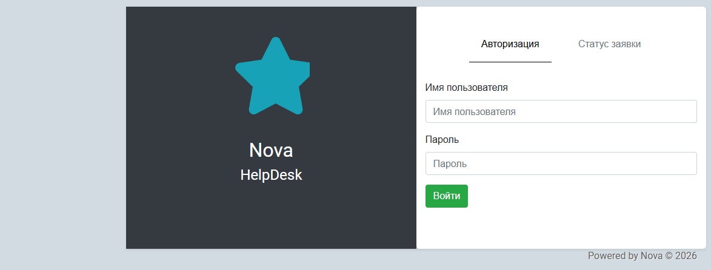

# Nova — тикет-система (HelpDesk)

Веб-приложение для приёма и обработки заявок в техподдержку: пользователи создают обращения, сотрудники берут их в работу, стороны общаются в комментариях и во встроенном чате. Пет-проект для портфолио на Django, все данные и брендинг демонстрационные.



## Возможности

- **Заявки**: создание, редактирование, приоритеты (низкий/высокий/критический), статусы (новый → в работе → на уточнении → предоставлен/закрыт), фильтры и поиск, экспорт в Excel
- **Вложения**: прикрепление файлов к заявке и к отдельным комментариям, drag-and-drop
- **Комментарии**: ответы на комментарии, отметка комментария как решения, уточняющие комментарии
- **Чат**: обмен сообщениями в реальном времени через WebSocket (Django Channels), бейдж непрочитанных, всплывающие уведомления
- **Профиль пользователя**: аватар, телефон/мессенджер/доп. почта с гибкой настройкой видимости
- **Проверка статуса заявки без входа в аккаунт** — по UID и email
- **Для сотрудников**: назначение исполнителя, аналитика с графиками, база данных заказчиков/продуктов/типовых решений
- **База знаний**: раздел со статьями документации
- **Email-уведомления** на ключевые события (новая заявка, назначение, смена статуса)

## Стек технологий

**Backend:** Python, Django 3.1, Django Channels (WebSocket / ASGI), SQLite
**Frontend:** Bootstrap 4, jQuery, Font Awesome, Trumbowyg (rich-text редактор), Flatpickr, Chart.js
**Прочее:** bleach (санитизация пользовательского HTML), XlsxWriter (экспорт отчётов)
**Инфраструктура:** Docker, Nginx, uWSGI/Gunicorn — готовые конфиги в `docker/`

## Запуск проекта локально

1. Создать и активировать виртуальное окружение:
   ```
   python -m venv venv
   venv\Scripts\activate        (Windows)
   source venv/bin/activate     (Linux / Mac)
   ```

2. Установить зависимости:
   ```
   pip install -r req.txt
   ```

3. **Создать файл `.env` из образца** (один раз):
   ```
   copy .env.example .env       (Windows)
   cp .env.example .env         (Linux / Mac)
   ```
   Затем при необходимости вписать в `.env` реальные значения.
   Без этого файла сайт запустится в безопасном режиме (DEBUG=False),
   и статика/отладка работать не будут — для локальной разработки `.env` нужен.

4. Применить миграции и запустить сервер:
   ```
   python manage.py migrate
   python manage.py runserver
   ```

Адрес: http://127.0.0.1:8000/

> Файл `.env` содержит секреты (ключи, пароли) и НЕ хранится в git.

## Запуск через Docker

Готовые Dockerfile для приложения и Nginx лежат в `docker/`. Пример:
```
docker build -t nova-web -f docker/nova/Dockerfile .
docker build -t nova-nginx -f docker/nginx/Dockerfile .
```
